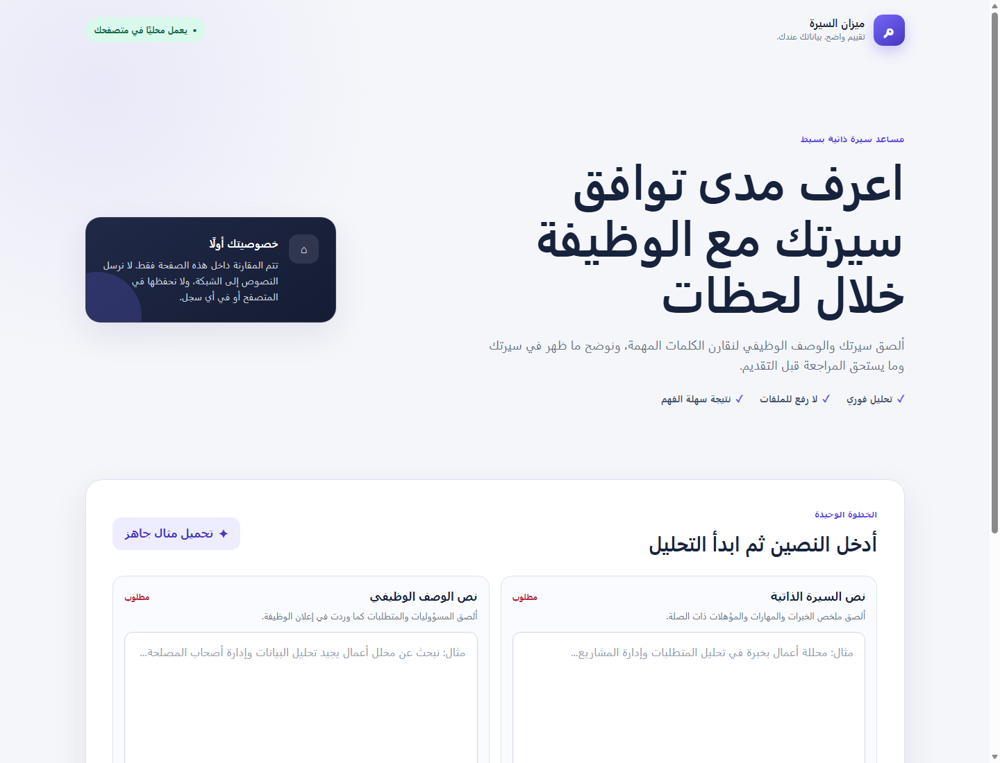

# ميزان السيرة — مساعد تقييم CV محلي

مشروع صغير يقارن نص السيرة الذاتية بالوصف الوظيفي، ثم يعرض درجة توافق من 100 والكلمات المتطابقة والمفقودة وتوصية قصيرة. تعمل النسخة بالكامل داخل المتصفح بلا API أو رفع ملفات أو تخزين للنصوص.

> النتيجة إرشادية وتعتمد على تطابق الكلمات، وليست قرار توظيف أو تقييمًا مهنيًا شاملًا.

## التشغيل

المتطلب الوحيد هو **Node.js**. من PowerShell داخل مجلد المشروع:

```powershell
node scripts/serve.mjs
```

ثم افتح `http://127.0.0.1:8000`، واضغط **تحميل مثال جاهز** ثم **تحليل التوافق**. ويمكن فتح المثال والنتيجة مباشرة عبر `http://127.0.0.1:8000/?demo=1`.

أوقف الخادم باستخدام `Ctrl+C`.

## الاختبار

```powershell
node --test tests/analyzer.test.mjs
node --test .agents/skills/ai-cv-agent-loop/tests/loop.test.mjs
node --check app.js
node --check analyzer.js
```

التحقق النهائي نجح في **6/6** اختبارات للمحلل و**5/5** اختبارات لمسار الوكلاء، إضافة إلى عرض الصفحة في Microsoft Edge وفحصها بعرض 1440 بكسل و390 بكسل.

## دور الوكيل والـSkill

- الوكيل المخصّص: [`.codex/agents/qa.toml`](.codex/agents/qa.toml). دوره مراجعة السلوك والخصوصية والأمان وإتاحة الاستخدام بصورة مستقلة، مع خطوات إعادة إنتاج واضحة لكل مشكلة.
- الـSkill المستخدمة: [`.agents/skills/ai-cv-agent-loop/SKILL.md`](.agents/skills/ai-cv-agent-loop/SKILL.md). نظّمت العمل عبر مراحل التخطيط والبناء والدمج والملاحظة والتصحيح والتحقق، وحفظت أدلة الانتقال من كل مرحلة دون حفظ محتوى أي سيرة ذاتية.
- أثناء البناء نُفّذ المحلل والواجهة بصورة منفصلة، ثم دمجهما القائد، ثم راجعهما وكيل QA. وجد QA أن README قديم وأن ملف ZIP مفقود؛ صُححت المشكلتان وأُعيد الاختبار.

## الخصوصية وحدود النسخة

- لا تستخدم الصفحة `fetch` أو XHR أو WebSocket.
- لا تستخدم `localStorage` أو `sessionStorage` أو قواعد بيانات المتصفح.
- لا تُسجّل نص السيرة في وحدة التحكم.
- يقبل الإصدار نصًا ملصقًا فقط؛ قراءة PDF/DOCX وخدمة الذكاء الاصطناعي والنشر إضافات اختيارية غير منفذة.

## لقطات التجربة

### 1. واجهة إدخال السيرة والوصف الوظيفي



### 2. مثال مكتمل ونتيجة التحليل


## أهم الملفات

```text
AI_CV/
├── index.html                 # واجهة التطبيق
├── styles.css                # التصميم العربي المتجاوب
├── app.js                    # ربط النموذج بالمحلل وعرض النتائج
├── analyzer.js               # تحليل الكلمات وحساب الدرجة
├── tests/analyzer.test.mjs   # اختبارات الوظيفة الأساسية
├── scripts/serve.mjs         # خادم محلي بسيط
├── PLAN.md                   # الفكرة والخطة والعقد
├── .codex/agents/qa.toml     # إعداد وكيل المراجعة
├── .agents/skills/ai-cv-agent-loop/
└── screenshots/              # لقطتا التسليم
```

الحزمة الجاهزة للتسليم: `AI_CV_Assistant_Submission.zip`.
